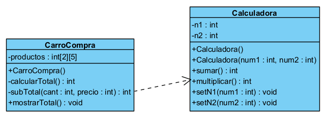

# Análisis de código & Dependencia

## Objetivo: 
Aplicar los conceptos de relaciones de dependencia entre clases.

## Actividades

1. **Identifique las clases y lo que estas representan. Luego, establezca una descripción textual breve del contexto problema.**

Se tienen dos clases:
* _**Calculadora**_

    Realiza dos operaciones suma y multiplicación, entre dos números enteros.

* _**CarroCompra**_
    
    Almacena en una matriz de _2x5_ la cantidad y precio de productos.

**Contexto**

Se necesita calcular el total de una compra realizada, utilizando un carrito de 5 productos, el cálculo se realiza multiplicando _cantidad_ y _precio_ de cada producto, y finalmente se suma todo.

2. **Analice los atributos y métodos de cada clase, luego, identifique las relaciones existentes entre las clases identificadas.**

* _**Calculadora**_

    Tiene:

  - Dos atributos del tipo **int** _n1_ y _n2_.
  - Un método para sumar y otro para multiplicar sus atributos.

* **_CarroCompra_**

    Tiene:

  - Un atributo, _productos_ del tipo int[][] de dimensión _2x5_.
  - Un método _calcularTotal()_, que suma el subtotal de cada producto y devuelve el total.
  - Un método _subTotal()_, que utiliza una instancia de la clase _Calculadora_ para devolver la multiplicación entre la cantidad y el precio de cada producto.
  - Un método mostrarTotal(), que llama a _calcularTotal()_ para mostrar el total de la compra.

* **Relación existente**

Entre ambas clases existe una relación de **dependencia**, debido a que, uno de los métodos de la clase _**CarroCompra**_ utiliza una instancia de la clase _**Calculadora**_. Entonces, _**CarroCompra**_ depende de la funcionalidad de _**Calculadora**_.

3. **De lo anterior, establezca una representación detallada del código fuente, usando un diagrama de clases UML y la herramienta de modelado _Visual Paradigm_.**

